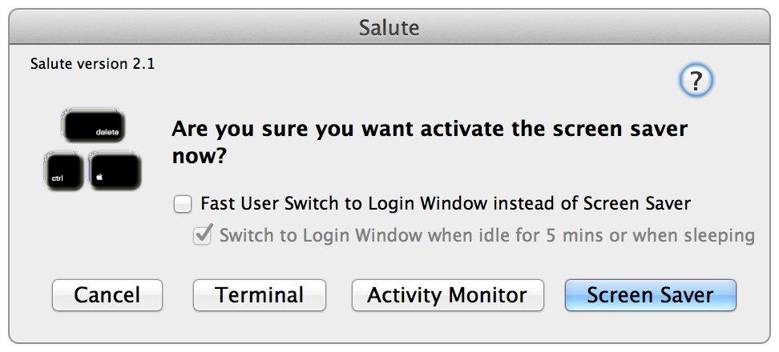

salute
======

Hot Key Three Finger Salute to lock screen in OS X
---------------------------------------------------

OS X does not have a built in mechanism to easily lock the screen using a key combination.  Salute allows you to press Control-command-delete to be prompted like this:

and you simply press return to engage the screensaver.  A couple of notes:

- I used control-command-delete since the combination is similar to that on windows.  The keys are different, but it "feels" right.  Try it.
- You have to set the screen saver to lock the screen in the security pane, otherwise it just engages the screensaver and you can exit it.
- there is an option to fast user switch to the login window
- there is an option to have a timer automatically switch to login window

tim
(http://twocanoes.com)
